# 🍔 foodorder_api

API REST para gestión de restaurantes: administra platos y pedidos de clientes.

## Tecnologías

- Python 3.13.2
- Django 5.2
- Django REST Framework 3.15.2

## Instalación y ejecución

```bash
# 1. Clonar el repositorio
git clone https://github.com/tu-usuario/foodorder_api.git
cd foodorder_api

# 2. Crear y activar entorno virtual
python -m venv venv
venv\Scripts\activate

# 3. Instalar dependencias
pip install -r requirements.txt

# 4. Aplicar migraciones
python manage.py migrate

# 5. Iniciar servidor
python manage.py runserver
```

---

## Endpoints — Platos

### Crear plato — POST `/api/platos/`

```json
{
  "nombre": "Salchipapa especial",
  "precio": "15.00",
  "categoria": "principal"
}
```

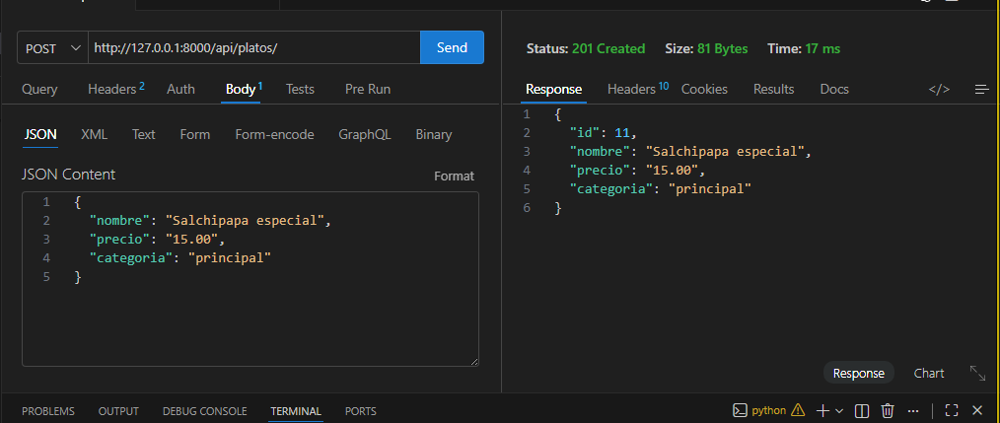

---

### Listar todos los platos — GET `/api/platos/`

```
GET http://127.0.0.1:8000/api/platos/
```

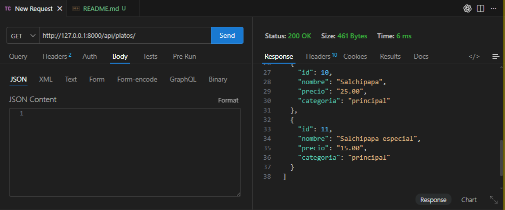

---

### Ver plato por ID — GET `/api/platos/2/`

```
GET http://127.0.0.1:8000/api/platos/2/
```

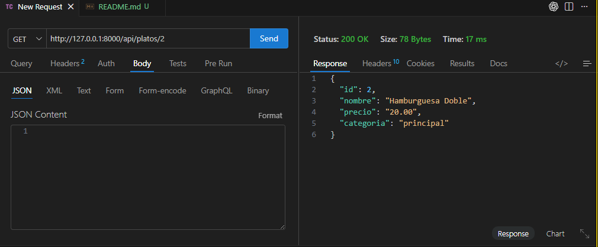

---

### Editar plato completo — PUT `/api/platos/2/`

```json
{
  "nombre": "Hamburguesa Doble",
  "precio": "20.00",
  "categoria": "principal"
}
```

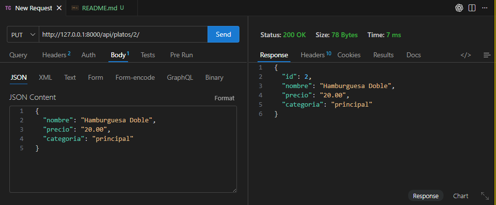

---

### Editar plato parcial — PATCH `/api/platos/3/`

```json
{
  "precio": "6.00"
}
```

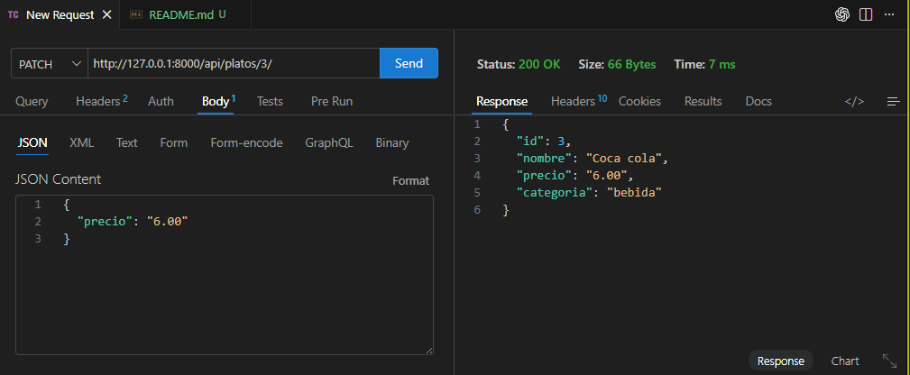

---

### Buscar por nombre — GET `/api/platos/?search=ceviche`

```
GET http://127.0.0.1:8000/api/platos/?search=ceviche
```

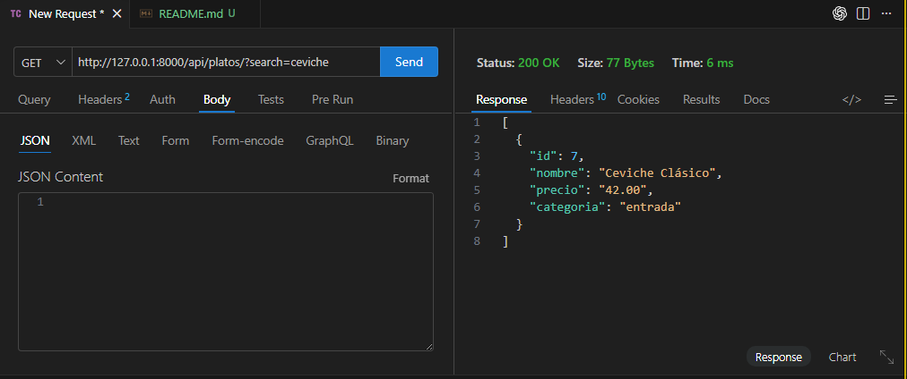

---

### Buscar por categoría — GET `/api/platos/?search=principal`

```
GET http://127.0.0.1:8000/api/platos/?search=principal
```

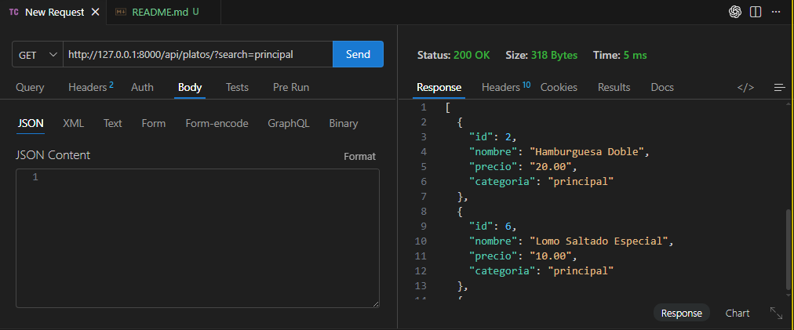

---

### Eliminar plato — DELETE `/api/platos/8/`

```
DELETE http://127.0.0.1:8000/api/platos/8/
```

Respuesta: `204 No Content`

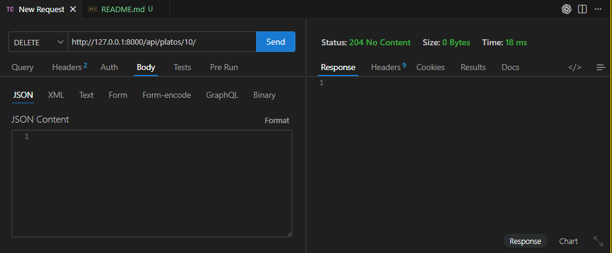

---

## Endpoints — Pedidos

### Crear pedido — POST `/api/pedidos/`

```json
{
  "total": "57.00",
  "estado": "pendiente",
  "platos": [7, 3]
}
```

Respuesta personalizada (punto extra): el campo `nombres_platos` muestra los nombres reales de los platos en lugar de solo sus IDs.

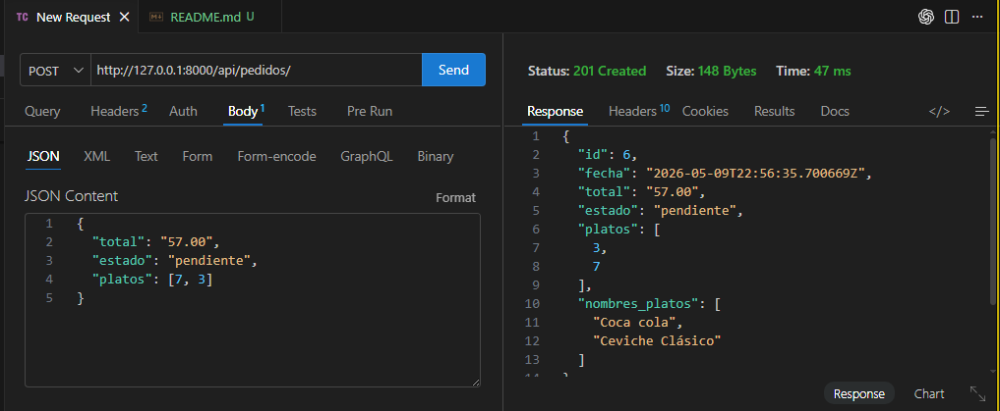

---

### Listar todos los pedidos — GET `/api/pedidos/`

```
GET http://127.0.0.1:8000/api/pedidos/
```

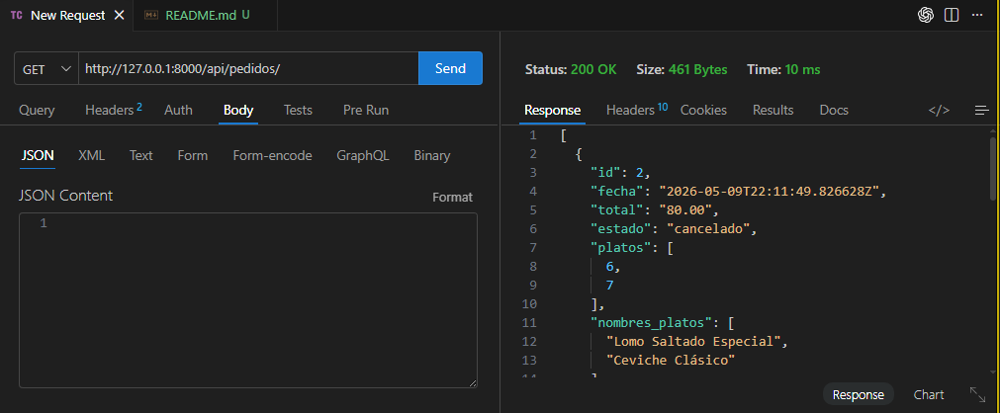

---

### Ver pedido por ID — GET `/api/pedidos/2/`

```
GET http://127.0.0.1:8000/api/pedidos/2/
```

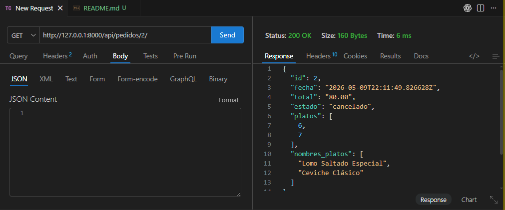

---

### Editar pedido completo — PUT `/api/pedidos/2/`

```json
{
  "total": "52.00",
  "estado": "en_proceso",
  "platos": [6, 7]
}
```

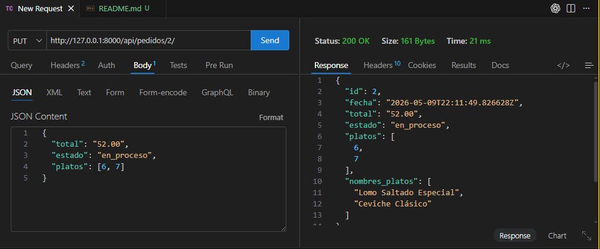

---

### Editar pedido parcial — PATCH `/api/pedidos/2/`

```json
{
  "estado": "completado"
}
```

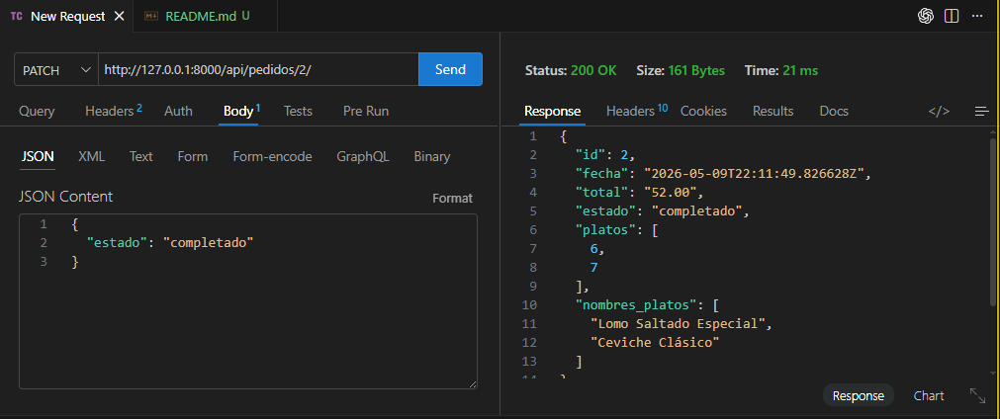

---

### Buscar por estado — GET `/api/pedidos/?search=pendiente`

```
GET http://127.0.0.1:8000/api/pedidos/?search=pendiente
```

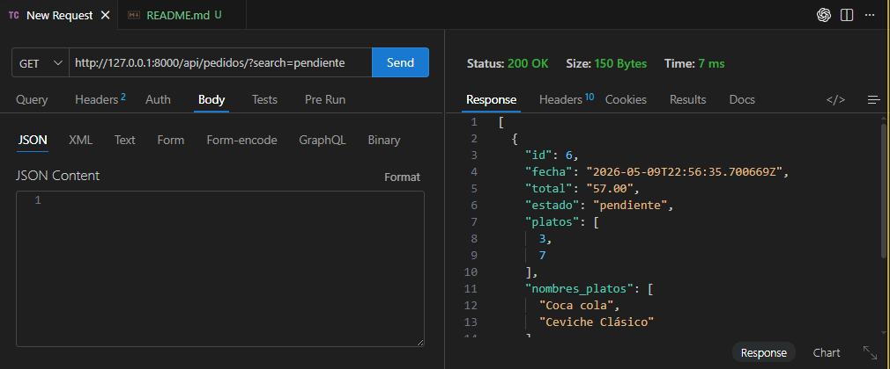

---

### Buscar por estado — GET `/api/pedidos/?search=completado`

```
GET http://127.0.0.1:8000/api/pedidos/?search=completado
```

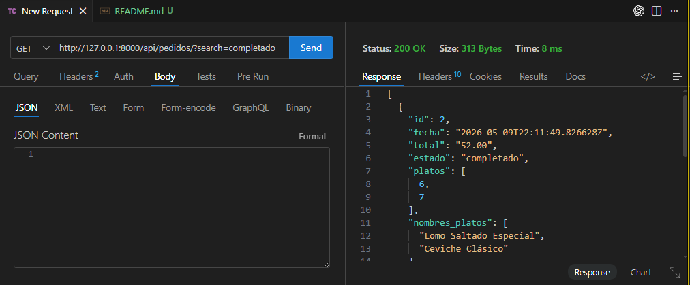

---

### Eliminar pedido — DELETE `/api/pedidos/3/`

```
DELETE http://127.0.0.1:8000/api/pedidos/3/
```

Respuesta: `204 No Content`

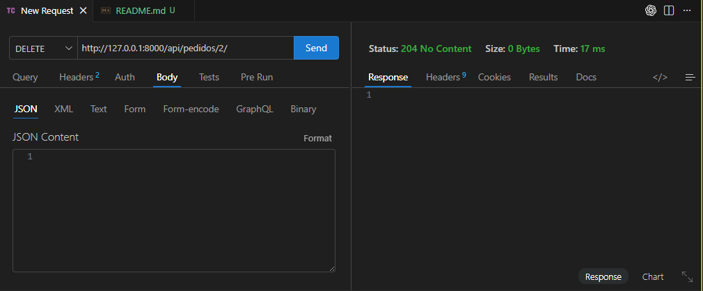